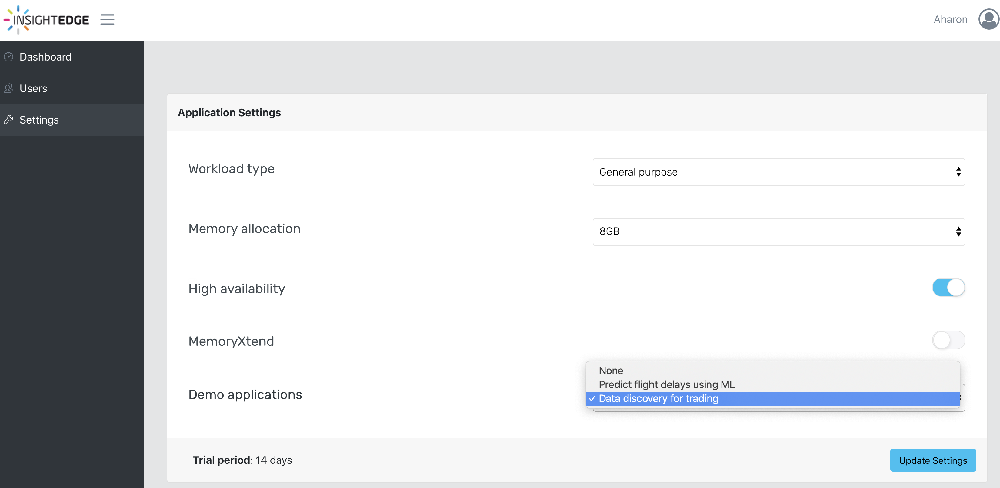
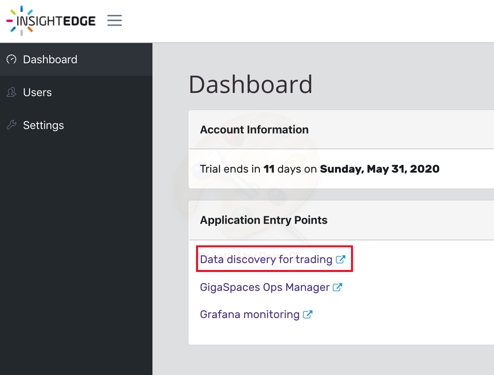
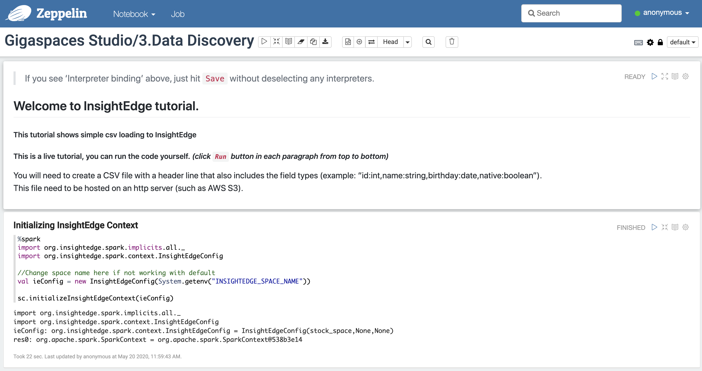
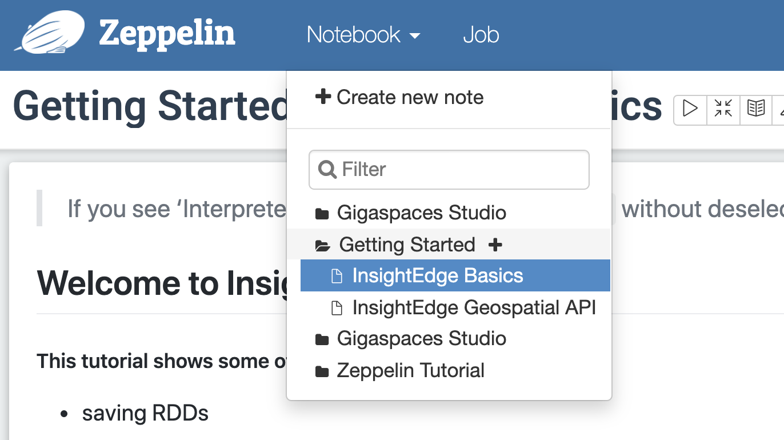
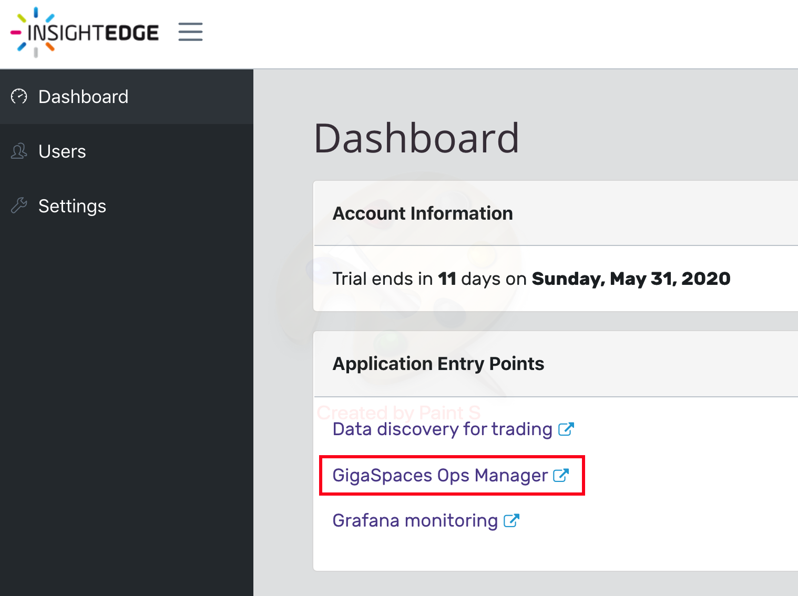
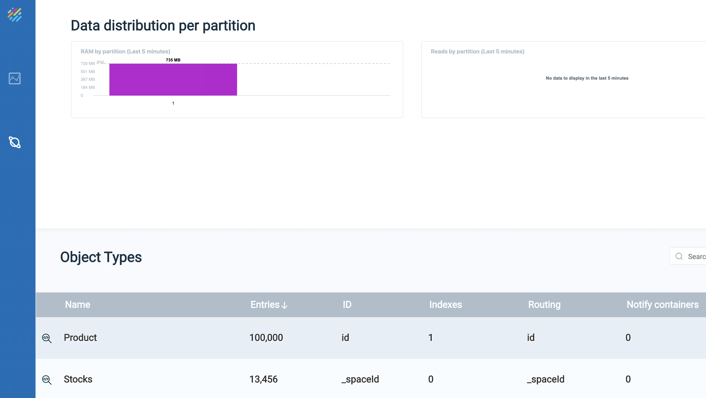

# PartnerWorkShop 
## Lab-2: New Ops manager
* Hands on workshop , introduction to the new Ops Manager and auto-connect options using GigaCloud

### In this lab you will setup InsightEdge as-a-service at GigaSpaces cloud.

Please follow all steps as appear: 
https://docs.gigaspaces.com/latest/gigaspaces-cloud.html

Please run the Data discovery for trading Demo application: 
  
From the Dashboard click Data discovery for trading: 
  
Run Gigaspaces Studio/3.Data Discovery Notebook: 
  
Run Getting Started/InsightEdge Basics: 
  
Go to GigaSpaces Ops Manager: 
  
See that stock and product records were inserted to the space: 
  

