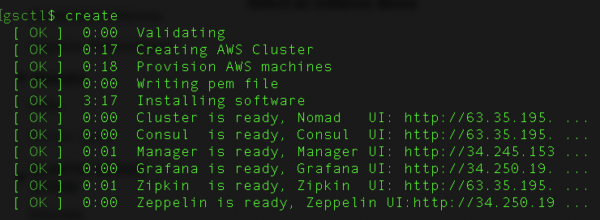
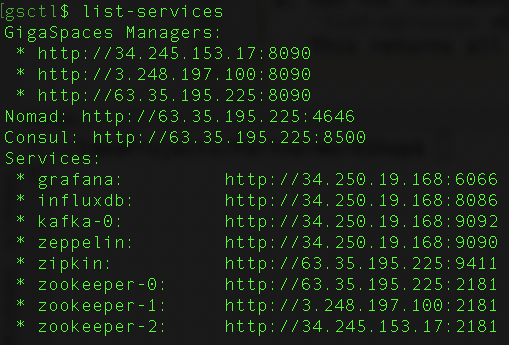
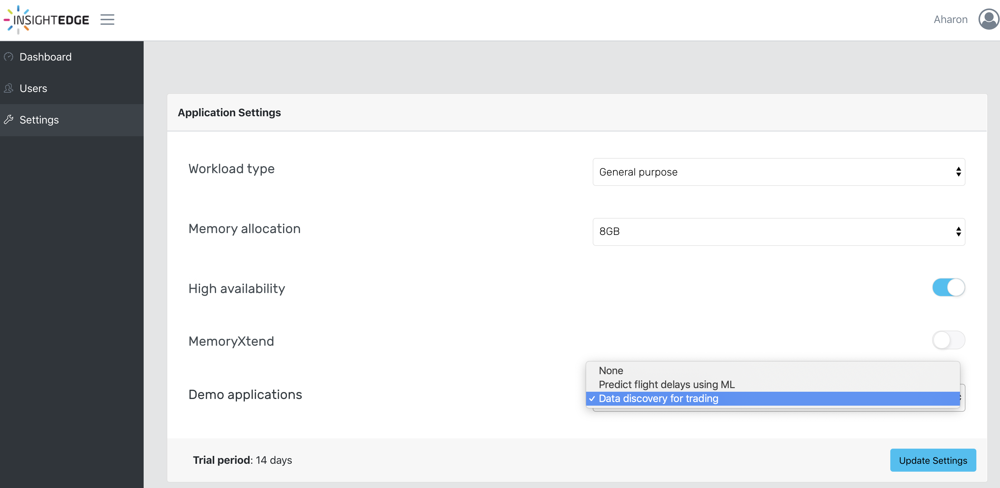
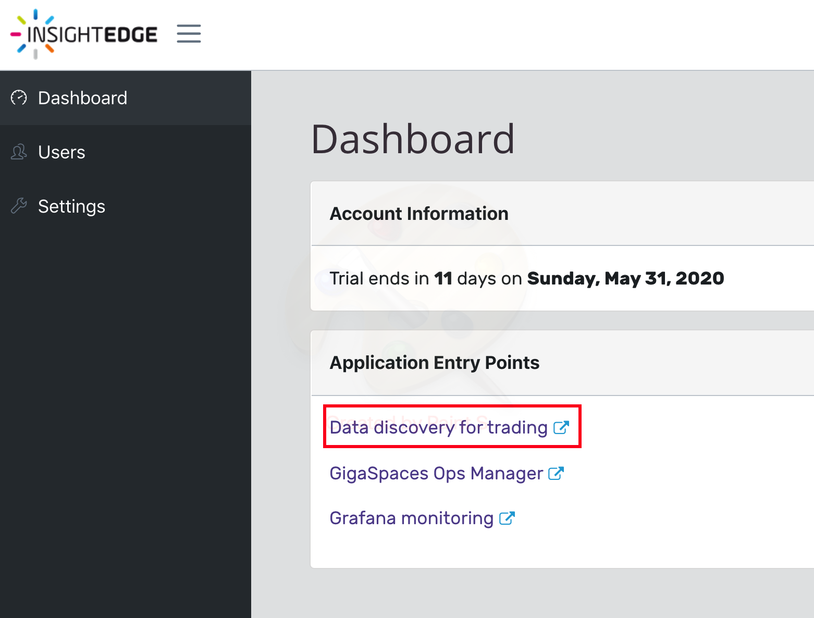
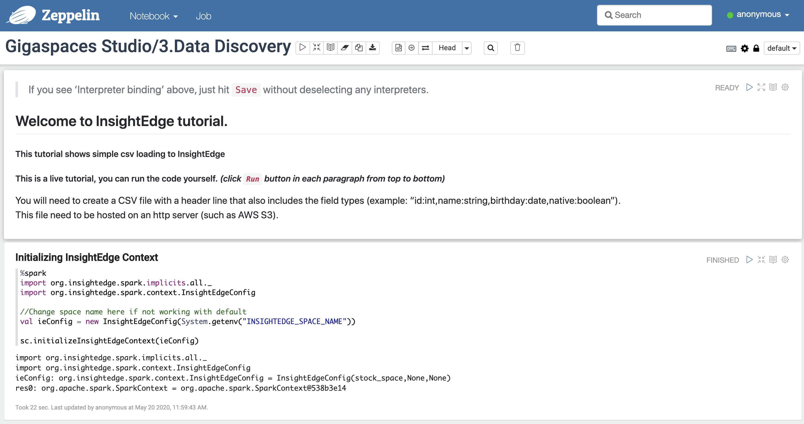
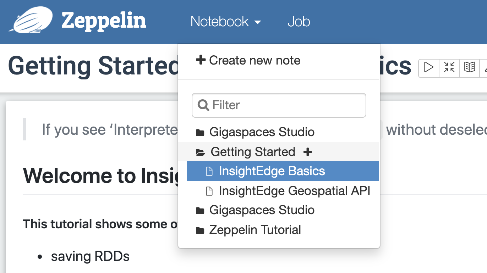
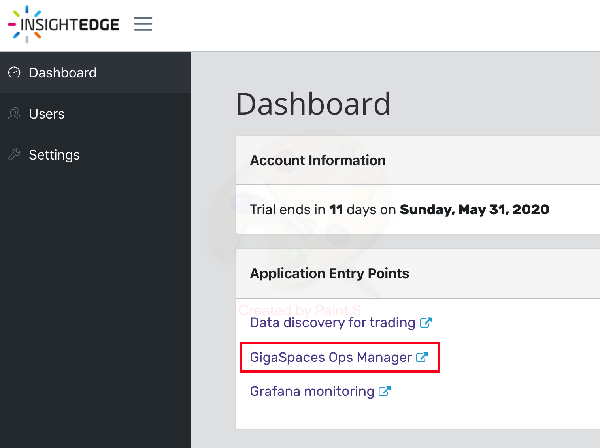

# PartnerWorkShop 
## Lab-3: Deploy a machine learning pipeline
* load data , enrich , train the model and predict Participants will use various industry leading building blocks such as spark , kafka and in-memory processing

### In this lab you will:
#### 1. Create an InsightEdge product gsctl cluster
#### 2. Deploy an application which consumes flight delay data to make binary predictions (yes/no) about which flights are likely to get delayed.

**Before starting the lab please:** 
Right click on the following 2 links and click Save Link As ...
* [Flight Delay Zeppelin Notebook1](https://amoll.s3-eu-west-1.amazonaws.com/Notebook/Gigaspaces+Studio_1.FlightDelays.json)
* [Flight Delay Zeppelin Notebook2](https://amoll.s3-eu-west-1.amazonaws.com/Notebook/Gigaspaces+Studio_2.Flight+Delays+2.json)

Please perform the following steps:

1. Enter the GSCTL interactive cli: 
   `java -jar gsctl.jar`  
2. Change product type from xap to insightedge: 
   `config product-type use insightedge`  
3. Create InsightEdge product gsctl cluster 
     
4. Run the following command: 
   `list-services` 
   This returns all the services with their URLs: 
     
5. Change artifact-repo to FlightDelay artifact repo: 
   `config artifact-repo use https://amoll.s3-eu-west-1.amazonaws.com/Services`  
6. Deploy flight_delay space (statefull pu which will hold the flights data) 
   `deploy --type=stateful --memory=2048 flights_space flight-delay-0.1.jar`  
7. Open zeppelin and import the two notebooks you saved in the beginning of the lab 
     
8. Change space name to “flights_space” in insightedge_jdbc interpreter 
     
9. Run all zeppelin paragraphs (one by one) until you reach the Kafka paragraph. 
   Before continuing to the kafka section your zeppelin last paragraph should yield accuracy = 0.79 
     
   Flights_space should have the following number of records: 
     
10. Deploy flights_feeder (stateless pu which will read flights from space and send to kafka) 
   `deploy --type=stateless --property=feeder.flights.path=/home/ec2-user/data.csv --property=kafka.bootstrapServer=kafka-0.service.consul:9092 flights_feeder kafka-pers-feeder.jar`  
11. Continue running the kafka streaming paragraph and the remaining zeppelin paragraphs.  
12. Last paragraph view should look something like: 
     
13. You are done with the lab!!! 
    Once you finish reviewing your work **Please Destroy the cluster**: 
    `destroy`
    

